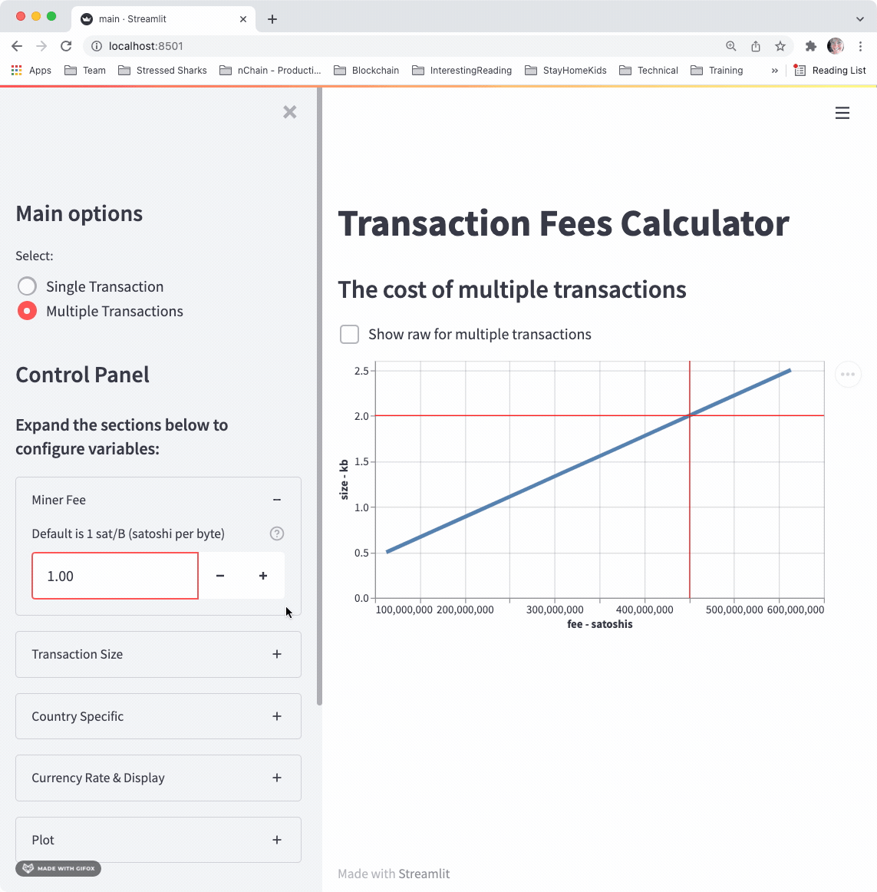

# Interactive Transaction Fee Calculator
This container runs a simple Streamlit application. 
The interactive app can be used to estimate transaction fees on the BSV network. 

## Quickstart
**Download Repo**

    git clone https://bitbucket.stressedsharks.com/scm/sdl/interactive-tx-fees.git

**To build and run with Docker**

    docker build . -t tx-fees
    docker run tx-fees

**To run on the command line**

    streamlit run main.py

**Open App**
http://localhost:8501/

**Python Requirements**
For running examples on the localhost, the following python modules are required:
- streamlit
- pandas
- numpy

 ## Demo

